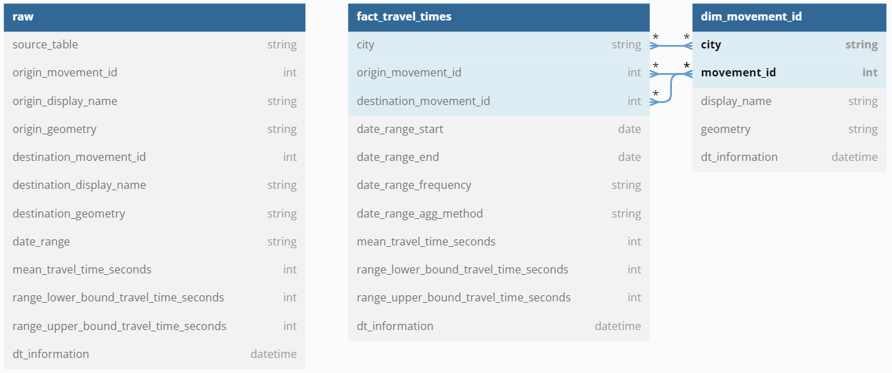

# Travel-Time---Uber-Movement

## Summary
The goal of this challenge is to automate the build of a scalable, efficient, highly available and
well organized data lake using the dataset provided due to be consumed for some etl pipelines.
To take into account:
* The Data Lake should be optimized for searching. Keep in mind that a data warehouse
is the final stage for this data.
* The data should be secure.

## Data
Uber Movement Dataset from Kaggle (https://data.world/rmiller107/travel-time-uber-movement)

## Data Model

## Data Pipeline
1. Read data from Data World API
2. Write data to local SQLite database

## Docker
* Create Docker image: docker build -t uber_movement .
* Run Docker Image: docker run uber_movement
* Check run NAME : docker ps -a
* Copy result DB file: docker cp docker_run_name:/app/sqlite.DB ./sqlite.DB